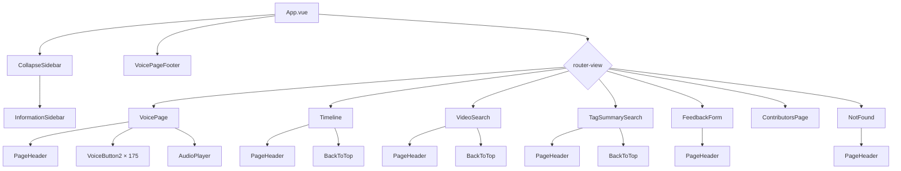
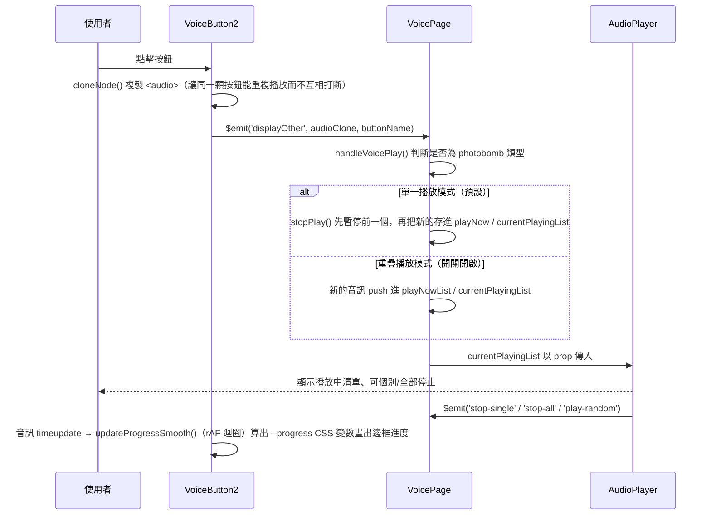
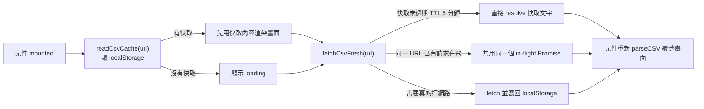

# 程式碼架構與內部邏輯

本文件從「程式碼怎麼運作」的角度整理 76button（祈菈語音按鈕）專案，是 [FEATURES.md](FEATURES.md) 的技術補充：

- **FEATURES.md**：使用者看到什麼功能、每個頁面能做什麼事。
- **本文件（ARCHITECTURE.md）**：這些功能在程式碼裡怎麼實作的——元件關係、狀態怎麼流動、事件怎麼傳遞、資料怎麼抓取與快取。

適合要修改程式碼、抓 bug、或第一次接手維護的人閱讀；只想知道網站有什麼功能，看 FEATURES.md 就夠了。

## 目錄

- [專案骨架與啟動流程](#專案骨架與啟動流程)
- [路由與版面結構](#路由與版面結構)
- [元件關係總覽](#元件關係總覽)
- [核心資料流程](#核心資料流程)
  - [語音播放狀態管理](#語音播放狀態管理voicepage--voicebutton2--audioplayer)
  - [直播 CSV 抓取與快取](#直播-csv-抓取與快取videosearch--tagsummarysearch--csvcachejs)
  - [標籤帶入篩選機制](#標籤帶入篩選機制tagsummarysearch--videosearch)
  - [時間軸年份分組與捲動同步](#時間軸年份分組與捲動同步timeline)
- [各元件職責一覽](#各元件職責一覽)
- [資料結構](#資料結構)
- [事件監聽與生命週期清理](#事件監聽與生命週期清理)
- [維護備註](#維護備註)

## 專案骨架與啟動流程

技術棧與建置指令請見 [FEATURES.md 的技術架構](FEATURES.md#技術架構)，這裡只講程式怎麼串起來：

1. [main.js](../src/main.js) 是唯一的進入點：建立 Vue app、掛上 `router`（來自 App.vue 匯出）與 `VueHead`（管理 `<head>`），引入全域樣式 `src/css/App.css` 與 Bootstrap CSS，最後掛載到 `#app`。
2. [App.vue](../src/App.vue) 身兼兩個角色：
   - **根元件**：畫出 `CollapseSidebar` + `router-view`（依路由載入對應頁面元件）+ `VoicePageFooter`，並用 `isSidebarOpen`（由 `CollapseSidebar` 透過 `sidebar-toggle` 事件回報）控制 `.main-content` 的 `margin-left`，做出側邊欄推開版面的效果。
   - **路由定義處**：`<script>` 區塊最下方直接 `createRouter(...)` 並 `export { router }` 給 main.js 使用（路由表見下一節）。
3. `App.vue` 的 `head()` 回傳 title/meta/OG 標籤，由 `@morr/vue3-head` 在執行期動態寫入 `<head>`，資料來源是 `chillaTitle` / `chillaContent` / `chillaPicture` 這三個 data。
4. `App.vue` 的 `created()` 會監聽 `window` 的 `keydown`，按下 `F12` 時把 `chillaTitle` 換成「歡迎加入大鼠維埃共婆黨」——**這跟 [VoicePage.vue](../src/components/VoicePage.vue) 自己另外監聽的 F12 彩蛋（換頭像、播影片）是兩段完全獨立的程式碼**，只是剛好在 `/voice` 頁面同時觸發、看起來像同一個效果。維護 F12 彩蛋時兩處都要記得改，細節見〈[維護備註](#維護備註)〉。

## 路由與版面結構

路由表定義於 [App.vue](../src/App.vue) 的 `routes`（`createWebHashHistory`，網址帶 `#`）：

| 路徑 | 元件 |
| --- | --- |
| `/`、`/voice` | VoicePage |
| `/feedback` | FeedbackForm |
| `/contributors` | ContributorsPage |
| `/timeline` | Timeline |
| `/video-search` | VideoSearch |
| `/tag-summary` | TagSummarySearch |
| `/:pathMatch(.*)*`（其他任何路徑） | NotFound |

版面固定結構（不隨路由改變）：

```
#app (.content-shifted 依 isSidebarOpen 切換)
├─ CollapseSidebar          ← 固定顯示，側邊欄本身管理自己的展開/收合 state
│   └─ InformationSidebar   ← 純展示社群連結，isSidebarOpen 只影響要不要顯示文字
└─ .main-content
    ├─ router-view          ← 依路徑載入上表其中一個頁面元件，並透過 v-bind 傳入 msg / isSidebarOpen
    └─ VoicePageFooter      ← 固定顯示於每個頁面最下方
```

`isSidebarOpen` 的資料流是「由下往上再由上往下」：`CollapseSidebar` 自己維護收合狀態並 `$emit('sidebar-toggle', ...)` 通知 `App.vue`；`App.vue` 存成自己的 data 後，再透過 `router-view` 的 `v-bind` 往下傳給目前的頁面元件（例如 `VoicePage`、`AudioPlayer` 都會用這個 prop 調整版面）。

## 元件關係總覽



`buttons/VoiceButton.vue` 與 `buttons/VoiceButton1.vue` 不在這張圖裡——它們沒有被任何地方引用，是舊版元件（見〈[維護備註](#維護備註)〉）。

## 核心資料流程

### 語音播放狀態管理（VoicePage / VoiceButton2 / AudioPlayer）

播放狀態其實分散在兩層：**每顆按鈕自己的播放進度**，跟**「目前正在播放哪些音效」這份全站唯一的清單**（後者才是單一/重疊播放規則的關鍵）。



實作細節：

- `VoiceButton2` 模板裡的 `<audio>` 只當作「素材」，真正播放的是 `togglePlay()` 用 `cloneNode()` 複製出來的新 `<audio>` 物件，所以重疊播放同一顆按鈕時彼此的進度、事件互不干擾。
- `VoicePage.displayOtherVoice()` 幫每個播放中的音訊配一個遞增的 `audioId`，並掛 `ended`/`pause` 事件監聽器，音訊結束或被暫停時自動從 `currentPlayingList` 移除（`removeFromPlayingList`）。
- 空白鍵（`VoicePage` 的 `handleKeydown`）呼叫 `stopPlay(true)`：停掉 `playNow`／`playNowList` 所有音訊，並在 `stopAll=true` 時一併清空「亂入王祈菈」的圖片列表。
- 「亂入王祈菈」（`photobombVoice` → `generatePhotobomb`）：先播語音，再產生 10 張圖片，位置在視窗內隨機選但避開中心 30% 區域（`centerXStart/End`、`centerYStart/End`），每張圖用 `Map`（`photobombList`）存 CSS 樣式字串，透過 `requestAnimationFrame` 讓 `opacity` 從 1 變 0 觸發 CSS transition 淡出，`setTimeout` 到期後標記進 `photobombDeleteList`，下次再觸發亂入時才真正從 `Map` 刪除；同時有 200 張的上限（`photobombList.size >= 200` 時不再新增）。
- `playRandomVoice()`（由 `AudioPlayer` 的「隨機」按鈕觸發）不是複用 `VoiceButton2` 的邏輯，而是直接在 `VoicePage` 用 `new Audio(require(...))` 另外建立一個音訊物件播放，播放成功才呼叫 `displayOtherVoice` 掛進清單。

### 直播 CSV 抓取與快取（VideoSearch / TagSummarySearch / csvCache.js）

`VideoSearch` 和 `TagSummarySearch` 都要抓同一份 Google 試算表發佈的 CSV（`VIDEO_TAGS_CSV_URL`），且該端點回應偏慢，所以共用 [utils/csvCache.js](../src/utils/csvCache.js) 做「先顯示快取、背景刷新」：



- `csvCache.js` 用 `CACHE_PREFIX + url` 當 key 存進 `localStorage`，內容是 `{ text, time }`；`CACHE_TTL_MS = 5 分鐘`，對齊 Google 該端點自己回應的 `Cache-Control: max-age=300`。
- `inFlightRequests`（`Map<url, Promise>`）確保同一個 URL 短時間內被多個地方呼叫時只真正打一次網路請求，其他呼叫者共用同一個 Promise。
- 兩個元件都各自實作了幾乎一樣的 `parseCSVLine`（處理 CSV 欄位裡的引號逃逸）與「跳過標題列、依欄位順序取值」的解析邏輯，`csvCache.js` 本身**不負責解析**，只管抓取與快取——這是刻意的職責切分（快取只認字串），但也代表兩邊的 CSV 解析程式碼是重複的，見〈[維護備註](#維護備註)〉。
- 錯誤處理策略是「有快取就不打擾使用者」：`fetchCsvFresh` 失敗時，若原本就有快取內容（`cached` 變數不為空），只在 console 記錄錯誤、畫面繼續顯示舊資料；只有完全沒有快取又抓取失敗，才會顯示 `loadError` 提示與「重新載入」按鈕。

### 標籤帶入篩選機制（TagSummarySearch → VideoSearch）

`TagSummarySearch` 統計出的標籤卡片被點擊時，不是在同一頁篩選，而是換頁帶參數：

1. `TagSummarySearch.goToVideoSearch(item)` 依目前分頁（開台類型/遊戲/歌曲/人員）對應標籤類型數字（1/2/3/4），用 `this.$router.push({ path: '/video-search', query: { tagType, tagName } })` 導頁。
2. `VideoSearch` 在 `mounted()` 先 `await this.loadAllData()` 把種類/角色下拉選單資料載完，再呼叫 `applyIncomingTagFilter()` 讀 `this.$route.query`：
   - `tagType === 1`（種類）→ 直接設定 `selectedCategory`。
   - `tagType === 4`（人員）且該名稱**存在**於已載入的 `characters` 清單中 → 設定 `selectedCharacter`；否則跟其他類型一樣退到關鍵字搜尋。
   - 其餘類型 → 塞進 `searchKeyword`（同時同步 `debouncedKeyword`，跳過防抖延遲直接生效）。
3. 套用完立刻 `this.$router.replace({ path: '/video-search' })` 清掉網址上的 query，避免使用者重新整理或瀏覽器上一頁/下一頁時重複套用。
4. `VideoSearch` 結果列表上的標籤徽章也能反向操作（`filterByTag`），點擊即依同樣的類型判斷邏輯即時套用篩選——這條路徑不經過路由，是同頁面內直接改 data。

### 時間軸年份分組與捲動同步（Timeline）

- `currentData`（computed）依「鴨子模式開關 `isAlternate`」與「目前分頁 `currentTab`」決定要顯示 4 份 JSON 資料中的哪一份。
- `historyYears`（computed）把 `currentData.items` 依 `date` 的年份分組成 `[{ year, items }]`；`filteredHistoryYears` 在此基礎上再依 `historySearchKeyword` 過濾標題/描述（年份分組結構保留，篩掉沒有符合項目的年份）。
- 畫面用 `v-for` 把 `filteredHistoryYears` 逐年畫成 `<section ref="historyYearSection">`；`initYearObserver()` 建立一個 `IntersectionObserver`（`rootMargin: '-15% 0px -75% 0px'`）盯著這些 section，捲動時目前可視的年份會被記成 `activeHistoryYear`，左側年份導覽列據此反白。
- 只要「分頁切換」「鴨子模式開關」「搜尋關鍵字改變」任一項讓 DOM 的 section 數量/內容變動，就必須 `cleanupYearObserver()` 再 `$nextTick` 後 `initYearObserver()` 重新監控——這三個觸發點分別在 `switchTab`、`toggleTimeline`、`watch: historySearchKeyword` 裡，都繞回同一個 `resetTimeline()`。
- 影片採用「點擊播放的 facade 模式」：預設只顯示 YouTube 縮圖（`img.youtube.com/vi/<id>/mqdefault.jpg`），使用者點擊後才把該影片 ID 加進 `loadedVideoFacades`（`Set`），畫面才切換成真正的 `youtube-nocookie.com` iframe——避免一次載入所有影片拖垮效能。影片 ID 用正規表示式 `getYouTubeId()` 從 `link`/`link2` 網址解析，解析不到時退回顯示「直播影片」文字標籤而非播放器。

## 各元件職責一覽

| 元件 | 檔案 | 主要職責 | 對外事件（$emit） |
| --- | --- | --- | --- |
| App | [App.vue](../src/App.vue) | 根元件、路由定義、`<head>` 標籤管理、版面推移 | — |
| CollapseSidebar | [CollapseSidebar.vue](../src/components/CollapseSidebar.vue) | 側邊欄展開/收合、響應式自動收合、首訪引導提示 | `sidebar-toggle` |
| InformationSidebar | [InformationSidebar.vue](../src/components/InformationSidebar.vue) | 純展示社群連結列表 | — |
| VoicePage | [VoicePage.vue](../src/components/VoicePage.vue) | 語音按鈕主頁、播放狀態總管、搜尋、亂入彩蛋、F12 彩蛋 | — |
| VoiceButton2 | [buttons/VoiceButton2.vue](../src/components/buttons/VoiceButton2.vue) | 單顆語音按鈕：播放、進度條、下載、來源連結 | `displayOther` |
| AudioPlayer | [AudioPlayer.vue](../src/components/AudioPlayer.vue) | 右下角固定播放器面板（純展示 + 操作按鈕） | `stop-all`、`stop-single`、`play-random` |
| Timeline | [Timeline.vue](../src/components/Timeline.vue) | 時間軸四資料集切換、年份分組、搜尋、影片 facade、燈箱 | — |
| VideoSearch | [VideoSearch.vue](../src/components/VideoSearch.vue) | 抓取直播標籤 CSV、多條件篩選、無限捲動 | — |
| TagSummarySearch | [TagSummarySearch.vue](../src/components/TagSummarySearch.vue) | 統計標籤出現次數、依類型分頁瀏覽、帶參數導頁 | — |
| FeedbackForm | [FeedbackForm.vue](../src/components/FeedbackForm.vue) | 純嵌入 Google 表單 iframe | — |
| ContributorsPage | [ContributorsPage.vue](../src/components/ContributorsPage.vue) | 貢獻者卡片列表（純展示） | — |
| NotFound | [NotFound.vue](../src/components/NotFound.vue) | 404 頁面（純展示） | — |
| PageHeader | [PageHeader.vue](../src/components/PageHeader.vue) | 共用標題區塊（圖片＋主副標題） | — |
| VoicePageFooter | [VoicePageFooter.vue](../src/components/VoicePageFooter.vue) | 共用頁尾（純展示） | — |
| BackToTop | [BackToTop.vue](../src/components/BackToTop.vue) | 捲動超過 300px 顯示的回頂端按鈕 | — |
| csvCache.js | [utils/csvCache.js](../src/utils/csvCache.js) | CSV 抓取的 localStorage 快取 + in-flight 請求去重 | — |

## 資料結構

**`button-list.json`**（陣列，每個分類一個物件）：

```jsonc
{
  "category": "分類名稱",       // 手風琴標題
  "type": "photobomb",         // 選填，只有「亂入王祈菈」那組會有這個值
  "btnList": [
    {
      "fileName": "音檔檔名",   // 對應 src/assets/sound/<fileName>.mp3
      "btnName": "按鈕顯示文字/下載檔名",
      "sourceUrl": "來源連結",
      "sourceType": "twitter"  // 選填；沒有這欄位或空字串＝YouTube 來源，"twitter"＝Twitter 來源
    }
  ]
}
```

**`sidebar-list.json`**：`{ href, icon, text }[]`，`href` 是不含開頭斜線的路由路徑片段，`icon` 對應 `src/css/ItemIcon.css` 裡定義的 icon class。

**`contributors-list.json`**：`{ name, contributions: { text, link?, linkText? }[] }[]`。同一人若有多項貢獻，`contributions` 就放多個項目（例如 Cow Lo 同時提供了語音按鈕與意見回饋頁的圖片素材，會合併成一張卡片、列出兩項貢獻）；`link`/`linkText` 為每個項目各自選填，沒有就不顯示連結。

**`timeline-*-data.json`**（四份時間軸資料共用同一種結構）：

```jsonc
{
  "title": "分頁標題",
  "items": [
    {
      "date": "YYYY-MM-DD",   // 用來分組年份與排序
      "title": "事件標題",
      "description": "事件描述",
      "video": "...",          // 選填，任何 YouTube 相關網址皆可，實際嵌入用的是 link/link2 解析出的 ID
      "image": "圖片網址",      // 選填，點擊會開燈箱
      "link": { "text": "...", "url": "..." },  // 選填
      "link2": { "text": "...", "url": "..." }  // 選填
    }
  ]
}
```

**直播標籤 CSV**（`VIDEO_TAGS_CSV_URL`，由社群協作維護的 Google 試算表發佈）欄位順序：`時間, 影片標題, 影片網址, 標籤 JSON 字串`。標籤 JSON 字串本身是 `{ t: Number, n: String }[]`，`t` 為標籤類型：`1=種類 2=遊戲 3=歌曲 4=人員 5=場次`。

**篩選選項 CSV**（`FILTER_OPTIONS_CSV_URL`）欄位順序：`名稱, 類型數字`，`VideoSearch` 只取用 `1`（種類）與 `4`（人員）兩種類型組成下拉選單。

## 事件監聽與生命週期清理

| 元件 | 監聽對象 | 事件 | 用途 | 清理時機 |
| --- | --- | --- | --- | --- |
| App.vue | `window` | `keydown`（F12） | 變更 `<title>` 文字 | 未移除；因 App.vue 本身不會被卸載，實務影響可忽略 |
| VoicePage.vue | `window` | `keydown`（Space / F12） | 停止播放 / 觸發 F12 彩蛋 | `beforeUnmount` 移除 |
| VoicePage.vue | `window` | `resize` | 更新亂入圖片邊界計算用的視窗寬高 | `beforeUnmount` 移除 |
| CollapseSidebar.vue | `window` | `resize` | 小尺寸裝置自動收合側邊欄 | `beforeUnmount` 移除 |
| CollapseSidebar.vue | `document` | `click` | 提示顯示中，點側邊欄以外區域關閉提示 | 依 `showHint` 於 `watch` 動態新增/移除，`beforeUnmount` 兜底再移除一次 |
| Timeline.vue | `IntersectionObserver` | 年份區塊可視變化 | 反白年份導覽列 | 每次重建前後呼叫 `cleanupYearObserver()`／`beforeUnmount` disconnect |
| VideoSearch.vue | `window` | `scroll` | 捲到底部自動載入更多結果 | `beforeUnmount` 移除 |
| BackToTop.vue（Timeline / VideoSearch / TagSummarySearch 共用） | `window` | `scroll` | 控制回頂端按鈕顯示 | `beforeUnmount` 移除 |
| VoiceButton2.vue | `requestAnimationFrame` | 播放進度輪詢 | 更新按鈕邊框進度條 | 音訊暫停/結束時於 `updateProgressSmooth` 內自行 `cancelAnimationFrame` |

## 維護備註

以下是文件鴨在通讀程式碼時觀察到、可能影響未來維護理解的地方；純記錄現況，不是問題清單或改動建議（需要深入抓問題的話可以請白箱鴨或審查鴨再看一次）：

- **F12 彩蛋分散在兩個元件**：`App.vue` 和 `VoicePage.vue` 各自獨立監聽 `window` 的 F12 `keydown`，彼此沒有共用狀態或呼叫關係，只是剛好都在 `/voice` 頁面生效、看起來像同一個彩蛋。之後要調整 F12 效果，兩處都要檢查。
- **CSV 解析邏輯重複**：`VideoSearch.vue` 與 `TagSummarySearch.vue` 各自實作了幾乎一樣的 `parseCSVLine`（處理 CSV 引號逃逸），`csvCache.js` 本身不做解析。如果 CSV 格式未來要調整，記得兩邊都要同步修改。
- **`VoiceButton.vue` / `VoiceButton1.vue` 為死代碼**：全站沒有任何地方引用（實際使用的是 `VoiceButton2.vue`），這點 [FEATURES.md 的已知技術債](FEATURES.md#已知技術債) 也有記錄。
- **App.vue 的 F12 監聽器沒有對應的移除**：因為 App.vue 是根元件、生命週期等同整個應用程式，目前沒有實際副作用，但如果之後把根元件拆分或做熱重載相關的重構，需要留意這個監聽器補上清理。
